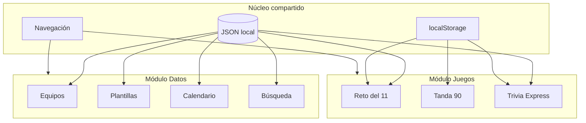

# 01 — Visión y alcance

## Resumen en una frase

**Mundial 2026 Hub** es una aplicación web personal para seguir el FIFA World Cup 2026: consultar equipos y horarios cuando lo necesites, y jugar minijuegos cortos basados en datos reales cuando te apetezca divertirte.

---

## Problema que resuelve

Durante un Mundial surgen dos necesidades distintas que las apps genéricas mezclan mal:

| Necesidad | Comportamiento deseado | Lo que suele fallar |
|-----------|------------------------|---------------------|
| **Consulta** | "¿A qué hora juega X?", "¿quién es el delantero de Y?" | Apps recargadas, publicidad, o datos dispersos |
| **Diversión** | 5–15 min de juego ligero con sabor a Mundial | Juegos desconectados del torneo real, o simuladores enormes |

Este proyecto **unifica ambas** en una sola experiencia coherente, sin depender de servicios externos frágiles durante el torneo.

---

## Usuarios objetivo

### Usuario principal (v1)

- **Perfil:** Aficionado al fútbol que sigue el Mundial 2026 de forma activa.
- **Contexto de uso:** Móvil y escritorio; antes de partidos, en descansos, entre jornadas.
- **Expectativas:**
  - Datos claros y rápidos (plantillas, calendario).
  - Juegos que no requieran sesiones largas.
  - Sin registro obligatorio.
  - Funciona offline para consulta (PWA + datos locales).

### Usuarios secundarios (futuro, no v1)

- Grupos de amigos con quiniela compartida.
- Usuarios que solo quieren el calendario (modo consulta puro).

---

## Objetivos del producto

### Objetivos primarios (v1)

1. **Consultar** los 48 equipos, sus plantillas y el calendario completo del torneo.
2. **Jugar** al menos un minijuego principal (*Reto del 11*) con datos reales.
3. **Persistir** preferencias y progreso localmente (favorito, récords, desafío diario).
4. **Instalar** como PWA en móvil.

### Objetivos secundarios (v1)

1. Segundo y tercer minijuego (*Tanda 90*, *Trivia Express*).
2. Modo sin spoilers para resultados.
3. Compartir resultado del Reto del 11 (texto/imagen).

### Objetivos explícitamente fuera de v1 (WON'T)

| Fuera de alcance | Motivo |
|------------------|--------|
| Simulación de partido completo (90 min) | Complejidad desproporcionada |
| Backend con autenticación y rankings globales | No necesario para uso personal |
| Quiniela multiplayer en tiempo real | Requiere infraestructura y moderación |
| APIs de pago o scraping en producción | Riesgo de rotura mid-tournament |
| Cobertura 100% de plantillas oficiales día 1 | Se construye progresivamente |
| Streaming o enlaces a retransmisiones | Legal y fuera de scope |

---

## Propuesta de valor

```
┌────────────────────────────────────────────────────────┐
│  "Mi hub del Mundial"                                  │
│                                                        │
│  · Un solo lugar para datos + juego                    │
│  · Rápido, sin cuenta, funciona en el móvil             │
│  · Conectado al torneo real (jugadores, grupos, fechas)│
│  · Sesiones cortas, no un FIFA clone                   │
└────────────────────────────────────────────────────────┘
```

---

## Principios de diseño del producto

1. **Datos primero, juego después** — La consulta debe ser útil desde el día 1 del torneo aunque los juegos no estén terminados.
2. **Sesiones cortas** — Ningún juego debe exigir más de 15 minutos por partida.
3. **Una fuente de verdad** — Jugadores y equipos existen una vez en JSON; juegos y vistas los consumen.
4. **Local by default** — Sin servidor en v1; progreso en el dispositivo.
5. **Actualizable** — Resultados y plantillas se pueden parchear sin redesplegar lógica de juego.
6. **Sin sorpresas** — Modo sin spoilers respetado; el usuario controla si ve resultados.

---

## Métricas de éxito (uso personal)

No hay analytics obligatorio en v1. El éxito se mide por:

| Métrica | Indicador |
|---------|-----------|
| Utilidad diaria | Abres calendario o plantillas al menos una vez por jornada |
| Engagement | Completas un Reto del 11 o Trivia varias veces por semana |
| Fiabilidad | La app carga datos sin error durante todo el torneo |
| Velocidad | Consulta de equipo o partido en < 2 s en móvil |

---

## Nombre y branding

| Elemento | Valor |
|----------|-------|
| Nombre de trabajo | **Mundial 2026 Hub** |
| Slug / carpeta | `mundial-2026-hub` |
| Tono visual | Noche de partido — oscuro, acentos verde césped / dorado trofeo |
| Idioma UI | Español (es-ES / es genérico) |

El nombre final puede cambiar; la documentación usa el slug técnico `mundial-2026-hub`.

---

## Relación entre módulos



---

## Decisiones de producto ya cerradas

| Decisión | Elección | Fecha |
|----------|----------|-------|
| Plataforma | Web PWA | 2026-06-09 |
| Backend v1 | Ninguno | 2026-06-09 |
| Fuente de datos | JSON estático en repo | 2026-06-09 |
| Juego principal | Reto del 11 | 2026-06-09 |
| Framework | Next.js (App Router) | 2026-06-09 |
| Estilos | Tailwind CSS | 2026-06-09 |

---

## Referencias cruzadas

- Formato del torneo → [04-tournament-context.md](./04-tournament-context.md)
- Detalle de funcionalidades → [05-features-data.md](./05-features-data.md), [06-features-games.md](./06-features-games.md)
- Plan de implementación → [08-development-roadmap.md](./08-development-roadmap.md)
