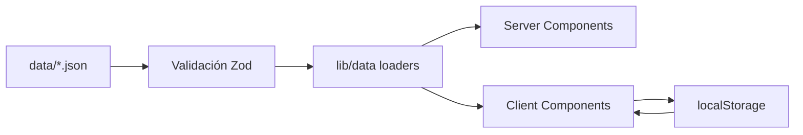

# 02 — Arquitectura técnica

## Stack tecnológico

| Capa | Tecnología | Versión objetivo | Motivo |
|------|------------|------------------|--------|
| Framework | **Next.js** (App Router) | 15.x | SSR/SSG, routing, PWA-friendly |
| Lenguaje | **TypeScript** | 5.x | Tipado alineado con esquemas de datos |
| Estilos | **Tailwind CSS** | 4.x / 3.x | Utilidades, diseño responsive rápido |
| Componentes UI | **shadcn/ui** (opcional) | latest | Accesibilidad, consistencia |
| Estado cliente | **React hooks** + **localStorage** | — | Sin Redux en v1 |
| Datos | **JSON estático** importado en build | — | Simple, versionable, offline |
| Validación datos | **Zod** | 3.x | Schemas = contrato de datos |
| Deploy | **Vercel** | — | Zero-config para Next.js |
| PWA | **next-pwa** o manifest manual | — | Instalable en móvil |

### WON'T en v1

- Base de datos (Postgres, SQLite)
- API Routes con lógica de negocio compleja
- Autenticación (NextAuth, Clerk)
- WebSockets / tiempo real

---

## Estructura de carpetas (objetivo)

```
mundial-2026-hub/
├── README.md
├── docs/                          # Esta documentación
├── public/
│   ├── manifest.json              # PWA
│   ├── icons/                     # Iconos PWA
│   └── flags/                     # Banderas SVG/PNG por teamId
├── data/                          # Fuente de verdad JSON
│   ├── tournament.json            # Meta del torneo
│   ├── teams.json
│   ├── players.json
│   ├── matches.json
│   ├── venues.json
│   └── challenges.json            # Plantillas de retos (Reto del 11)
├── src/
│   ├── app/                       # Next.js App Router
│   │   ├── layout.tsx
│   │   ├── page.tsx               # Inicio / dashboard
│   │   ├── equipos/
│   │   │   ├── page.tsx           # Lista equipos
│   │   │   └── [teamId]/page.tsx  # Detalle equipo
│   │   ├── calendario/
│   │   │   └── page.tsx
│   │   ├── buscar/
│   │   │   └── page.tsx
│   │   ├── juegos/
│   │   │   ├── page.tsx           # Hub de juegos
│   │   │   ├── reto-del-11/
│   │   │   ├── tanda-90/
│   │   │   └── trivia/
│   │   └── configuracion/
│   │       └── page.tsx
│   ├── components/
│   │   ├── layout/                # Header, Nav, Footer
│   │   ├── data/                  # TeamCard, MatchRow, PlayerList
│   │   ├── games/                 # Pitch, PenaltyGame, QuizCard
│   │   └── ui/                    # Botones, modales (shadcn)
│   ├── lib/
│   │   ├── data/                  # Loaders, filtros, búsqueda
│   │   ├── games/                 # Lógica de puntuación, reglas
│   │   ├── storage/               # localStorage helpers
│   │   └── utils/                 # Fechas, formateo
│   └── types/
│       └── index.ts               # Re-export tipos Zod inferidos
├── scripts/
│   └── validate-data.ts           # CI: validar JSON contra Zod
└── package.json
```

---

## Flujo de datos



### Carga de datos

1. Los archivos en `data/` se importan en **build time** (o se leen en Server Components).
2. `scripts/validate-data.ts` valida integridad referencial antes de deploy.
3. Los Client Components reciben datos ya tipados vía props o contexto ligero.
4. **No hay fetch a APIs externas en v1** salvo assets estáticos (banderas).

### Persistencia local (`localStorage`)

| Clave | Contenido |
|-------|-----------|
| `mundial2026_settings` | favorito, timezone, spoilerMode |
| `mundial2026_reto11` | récords, historial, daily seed completado |
| `mundial2026_tanda90` | high score, stats |
| `mundial2026_trivia` | récord, racha |

Esquema versionado internamente (`version: 1`) para migraciones futuras.

---

## Routing y navegación

| Ruta | Tipo | Descripción |
|------|------|-------------|
| `/` | Server | Dashboard: hoy, favorito, accesos rápidos |
| `/equipos` | Server | Grid de 48 selecciones |
| `/equipos/[teamId]` | Server | Detalle + plantilla |
| `/calendario` | Server + Client | Filtros interactivos |
| `/buscar` | Client | Búsqueda instantánea |
| `/juegos` | Server | Selector de minijuegos |
| `/juegos/reto-del-11` | Client | Juego principal |
| `/juegos/tanda-90` | Client | Canvas/interacción |
| `/juegos/trivia` | Client | Quiz |
| `/configuracion` | Client | Preferencias |

### Navegación global

Barra inferior en móvil (4 ítems):

```
Inicio | Equipos | Calendario | Juegos
```

Header con búsqueda y acceso a configuración.

---

## Renderizado

| Página | Estrategia | Razón |
|--------|------------|-------|
| Equipos, detalle equipo | **SSG** | Datos estáticos, SEO irrelevante pero performance máxima |
| Calendario | **SSG** + hidratación filtros | Misma razón |
| Juegos | **CSR** | Interactividad, estado, animaciones |
| Inicio | **SSG** + Client islands | Mezcla dashboard estático y favorito dinámico |

`revalidate` no es necesario en v1 si los datos se actualizan con redeploy. Opcional: `revalidate: 3600` si se adopta ISR más adelante.

---

## Capa de tipos y validación

```typescript
// Patrón: Zod schema → tipo inferido → validación en script CI

import { z } from 'zod';

export const PlayerSchema = z.object({
  id: z.string(),
  name: z.string(),
  teamId: z.string(),
  position: z.enum(['GK', 'DF', 'MF', 'FW']),
  club: z.string().optional(),
  number: z.number().int().min(1).max(99).optional(),
  rating: z.number().min(1).max(99),
});

export type Player = z.infer<typeof PlayerSchema>;
```

Todos los esquemas detallados en [03-data-model.md](./03-data-model.md).

---

## Lógica de juegos (ubicación)

| Juego | Módulo | Responsabilidad |
|-------|--------|-----------------|
| Reto del 11 | `lib/games/reto11/` | Reglas, validación de once, scoring |
| Tanda 90 | `lib/games/tanda90/` | Turnos, IA portero/tirador, RNG |
| Trivia | `lib/games/trivia/` | Generación de preguntas, timer |

Los componentes en `components/games/` solo renderizan; la lógica pura vive en `lib/games/` para ser testeable.

---

## Seguridad y privacidad

| Aspecto | Enfoque v1 |
|---------|------------|
| Datos personales | Ninguno recolectado |
| localStorage | Solo preferencias y puntuaciones |
| Dependencias | Mantener mínimas, auditar con `npm audit` |
| XSS | React escapa por defecto; no `dangerouslySetInnerHTML` |

---

## Performance objetivos

| Métrica | Objetivo |
|---------|----------|
| LCP (móvil) | < 2.5 s |
| Tamaño bundle juegos | Lazy load por ruta `/juegos/*` |
| JSON total | < 2 MB (comprimir con gzip en deploy) |
| Lighthouse PWA | Score ≥ 90 en categoría PWA |

---

## Entorno y despliegue

```bash
# Desarrollo
npm run dev

# Validar datos
npm run validate-data

# Build producción
npm run build

# Deploy (Vercel)
vercel --prod
```

### Variables de entorno

Ninguna obligatoria en v1. Opcional:

| Variable | Uso |
|----------|-----|
| `NEXT_PUBLIC_APP_URL` | URLs de compartir |

---

## Testing (recomendado, no bloqueante v1)

| Tipo | Qué cubrir |
|------|------------|
| Unit | `lib/games/*` scoring y reglas |
| Integration | `validate-data.ts` con fixtures |
| E2E (opcional) | Flujo Reto del 11 feliz |

---

## Decisiones arquitectónicas (ADR resumidas)

### ADR-001: JSON estático vs API externa

- **Decisión:** JSON en repo.
- **Contexto:** APIs gratuitas de fútbol son inestables; el torneo dura un mes.
- **Consecuencias:** Actualización manual o script; datos siempre disponibles offline.

### ADR-002: Sin backend en v1

- **Decisión:** Solo frontend + datos estáticos.
- **Contexto:** Uso personal, sin multiplayer.
- **Consecuencias:** Rankings globales imposibles; localStorage suficiente.

### ADR-003: Next.js App Router

- **Decisión:** App Router con Server Components para vistas de datos.
- **Contexto:** Mejor performance en consultas; juegos aislados en Client.
- **Consecuencias:** Curva de aprendizaje RSC; beneficio en carga inicial.

---

## Referencias

- Esquemas → [03-data-model.md](./03-data-model.md)
- UI → [07-ui-ux.md](./07-ui-ux.md)
- Fases → [08-development-roadmap.md](./08-development-roadmap.md)
