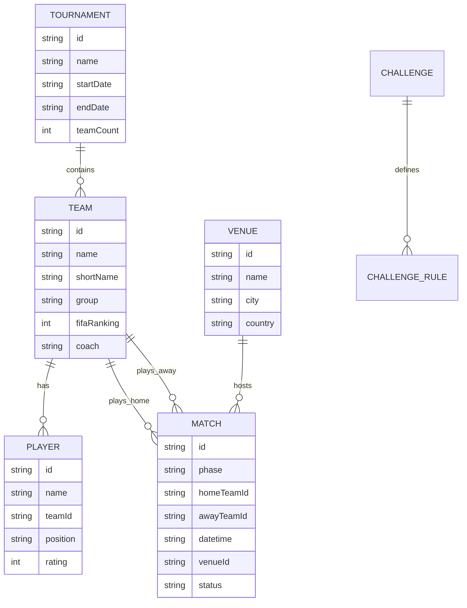

# 03 — Modelo de datos

## Principios

1. **Un jugador, un registro** — `players.json` es la fuente; equipos referencian por `teamId`.
2. **IDs estables** — Slug en minúsculas, sin espacios: `argentina`, `lionel-messi`.
3. **Integridad referencial** — Todo `teamId` en players/matches debe existir en `teams.json`.
4. **Validación obligatoria** — Script `validate-data.ts` ejecuta Zod + reglas custom antes de build.
5. **Campos opcionales explícitos** — Usar `null` o omitir según convención documentada por entidad.

---

## Diagrama de entidades



---

## Archivo: `data/tournament.json`

Metadatos globales del torneo.

```json
{
  "id": "fifa-world-cup-2026",
  "name": "FIFA World Cup 2026",
  "shortName": "Mundial 2026",
  "hostCountries": ["Estados Unidos", "Canadá", "México"],
  "startDate": "2026-06-11",
  "endDate": "2026-07-19",
  "teamCount": 48,
  "timezoneDefault": "America/Mexico_City",
  "currentPhase": "group",
  "dataVersion": 1,
  "lastUpdated": "2026-06-09"
}
```

| Campo | Tipo | Requerido | Descripción |
|-------|------|-----------|-------------|
| `id` | string | ✅ | Identificador fijo |
| `name` | string | ✅ | Nombre oficial |
| `hostCountries` | string[] | ✅ | Países sede |
| `startDate` / `endDate` | ISO date | ✅ | Rango del torneo |
| `teamCount` | number | ✅ | 48 en 2026 |
| `currentPhase` | enum | ✅ | `group` \| `round_of_32` \| `round_of_16` \| `quarter` \| `semi` \| `third_place` \| `final` \| `finished` |
| `dataVersion` | number | ✅ | Incrementar en cambios breaking |
| `lastUpdated` | ISO date | ✅ | Última actualización manual |

---

## Archivo: `data/teams.json`

Array de selecciones.

```json
[
  {
    "id": "argentina",
    "name": "Argentina",
    "shortName": "ARG",
    "group": "J",
    "fifaRanking": 1,
    "coach": "Lionel Scaloni",
    "confederation": "CONMEBOL",
    "flagCode": "ar",
    "primaryColor": "#75AADB",
    "secondaryColor": "#FFFFFF"
  }
]
```

| Campo | Tipo | Requerido | Descripción |
|-------|------|-----------|-------------|
| `id` | string | ✅ | Slug único |
| `name` | string | ✅ | Nombre en español |
| `shortName` | string | ✅ | 3 letras |
| `group` | string | ✅ | A–L (12 grupos en 2026) |
| `fifaRanking` | number | ✅ | Ranking FIFA al momento del seed |
| `coach` | string | ✅ | Entrenador principal |
| `confederation` | enum | ✅ | UEFA, CONMEBOL, CONCACAF, CAF, AFC, OFC |
| `flagCode` | string | ✅ | ISO 3166-1 alpha-2 minúsculas |
| `primaryColor` | string | ❌ | Hex para UI |
| `secondaryColor` | string | ❌ | Hex para UI |

---

## Archivo: `data/players.json`

Array de jugadores. En v1 se seedean jugadores clave; la plantilla completa crece progresivamente.

```json
[
  {
    "id": "lionel-messi",
    "name": "Lionel Messi",
    "teamId": "argentina",
    "position": "FW",
    "detailedPosition": "RW",
    "number": 10,
    "club": "Inter Miami",
    "age": 39,
    "rating": 88,
    "nationality": "argentina",
    "isKeyPlayer": true
  }
]
```

| Campo | Tipo | Requerido | Descripción |
|-------|------|-----------|-------------|
| `id` | string | ✅ | Slug único global |
| `name` | string | ✅ | Nombre display |
| `teamId` | string | ✅ | FK → teams.id |
| `position` | enum | ✅ | `GK` \| `DF` \| `MF` \| `FW` |
| `detailedPosition` | string | ❌ | RW, CB, CDM, etc. |
| `number` | number | ❌ | Dorsal en el Mundial |
| `club` | string | ❌ | Club actual |
| `age` | number | ❌ | Edad al inicio del torneo |
| `rating` | number | ✅ | 1–99, usado en Reto del 11 |
| `nationality` | string | ❌ | Redundante con teamId; útil en retos multi-nación |
| `isKeyPlayer` | boolean | ❌ | Destacado en ficha de equipo |

### Reglas de rating

- Escala **1–99** estilo FIFA simplificado.
- Seed inicial: estrellas 85+, titulares 75–84, suplentes 65–74, reservas 55–64.
- Los ratings **no se actualizan automáticamente** durante el torneo en v1 (manual si se desea).

---

## Archivo: `data/venues.json`

```json
[
  {
    "id": "estadio-azteca",
    "name": "Estadio Azteca",
    "city": "Ciudad de México",
    "country": "México",
    "capacity": 87523,
    "timezone": "America/Mexico_City"
  }
]
```

---

## Archivo: `data/matches.json`

```json
[
  {
    "id": "match-group-j-001",
    "phase": "group",
    "group": "J",
    "matchday": 1,
    "homeTeamId": "argentina",
    "awayTeamId": "canada",
    "datetime": "2026-06-11T19:00:00-06:00",
    "venueId": "estadio-azteca",
    "status": "scheduled",
    "score": null,
    "penaltyScore": null
  }
]
```

| Campo | Tipo | Requerido | Descripción |
|-------|------|-----------|-------------|
| `id` | string | ✅ | Único |
| `phase` | enum | ✅ | Ver tabla de fases abajo |
| `group` | string | ❌ | Solo fase de grupos (A–L) |
| `matchday` | number | ❌ | Jornada 1–3 en grupos |
| `homeTeamId` / `awayTeamId` | string | ✅ | FK → teams |
| `datetime` | ISO 8601 | ✅ | Con offset de sede |
| `venueId` | string | ✅ | FK → venues |
| `status` | enum | ✅ | `scheduled` \| `live` \| `finished` \| `postponed` |
| `score` | object \| null | ❌ | `{ home: number, away: number }` |
| `penaltyScore` | object \| null | ❌ | Solo si hubo penales en el 90' |

### Valores de `phase`

| Valor | Descripción |
|-------|-------------|
| `group` | Fase de grupos |
| `round_of_32` | Dieciseisavos (nuevo formato 48 equipos) |
| `round_of_16` | Octavos de final |
| `quarter` | Cuartos |
| `semi` | Semifinales |
| `third_place` | Tercer puesto |
| `final` | Final |

---

## Archivo: `data/challenges.json`

Plantillas de retos para *Reto del 11*. El motor interpreta `rules`.

```json
[
  {
    "id": "budget-100",
    "type": "daily",
    "title": "Presupuesto 100",
    "description": "Monta tu once sin superar 100 puntos de presupuesto.",
    "rules": {
      "maxPlayers": 11,
      "budget": 100,
      "maxPerTeam": 3,
      "requiredPositions": {
        "GK": 1,
        "DF": 3,
        "MF": 3,
        "FW": 2
      },
      "formation": "4-3-3"
    },
    "scoring": {
      "base": "sum_rating",
      "bonuses": [
        { "type": "same_team_pairs", "points": 2, "minPairs": 2 },
        { "type": "all_confederations", "points": 5 }
      ]
    }
  }
]
```

### Tipos de regla (`rules`)

| Regla | Tipo | Descripción |
|-------|------|-------------|
| `maxPlayers` | number | Siempre 11 |
| `budget` | number | Suma de `cost` (por defecto = rating) ≤ budget |
| `maxPerTeam` | number | Máximo jugadores de la misma selección |
| `minPerTeam` | number | Mínimo de una selección específica (requiere `teamId` extra) |
| `allowedGroups` | string[] | Solo jugadores de esos grupos |
| `allowedTeams` | string[] | Solo esas selecciones |
| `requiredPositions` | object | Mínimos por posición |
| `excludedPlayers` | string[] | IDs prohibidos |
| `formation` | string | Visual; 4-3-3, 4-4-2, etc. |

---

## Esquema Zod consolidado (referencia implementación)

```typescript
import { z } from 'zod';

export const PositionSchema = z.enum(['GK', 'DF', 'MF', 'FW']);

export const TeamSchema = z.object({
  id: z.string().min(1),
  name: z.string().min(1),
  shortName: z.string().length(3),
  group: z.string().regex(/^[A-L]$/),
  fifaRanking: z.number().int().positive(),
  coach: z.string().min(1),
  confederation: z.enum(['UEFA', 'CONMEBOL', 'CONCACAF', 'CAF', 'AFC', 'OFC']),
  flagCode: z.string().length(2),
  primaryColor: z.string().regex(/^#[0-9A-Fa-f]{6}$/).optional(),
  secondaryColor: z.string().regex(/^#[0-9A-Fa-f]{6}$/).optional(),
});

export const PlayerSchema = z.object({
  id: z.string().min(1),
  name: z.string().min(1),
  teamId: z.string().min(1),
  position: PositionSchema,
  detailedPosition: z.string().optional(),
  number: z.number().int().min(1).max(99).optional(),
  club: z.string().optional(),
  age: z.number().int().min(16).max(45).optional(),
  rating: z.number().int().min(1).max(99),
  nationality: z.string().optional(),
  isKeyPlayer: z.boolean().optional(),
});

export const ScoreSchema = z.object({
  home: z.number().int().min(0),
  away: z.number().int().min(0),
});

export const MatchSchema = z.object({
  id: z.string().min(1),
  phase: z.enum([
    'group', 'round_of_32', 'round_of_16',
    'quarter', 'semi', 'third_place', 'final'
  ]),
  group: z.string().regex(/^[A-L]$/).optional(),
  matchday: z.number().int().min(1).max(3).optional(),
  homeTeamId: z.string().min(1),
  awayTeamId: z.string().min(1),
  datetime: z.string().datetime({ offset: true }),
  venueId: z.string().min(1),
  status: z.enum(['scheduled', 'live', 'finished', 'postponed']),
  score: ScoreSchema.nullable().optional(),
  penaltyScore: ScoreSchema.nullable().optional(),
});
```

---

## Reglas de validación custom (script)

El script `validate-data.ts` DEBE comprobar:

1. **Unicidad de IDs** en cada archivo y entre players.
2. **FK teams** — Todo `teamId` en `players.json` existe en `teams.json`.
3. **FK matches** — `homeTeamId`, `awayTeamId`, `venueId` válidos.
4. **Grupos** — Exactamente 4 equipos por grupo A–L (cuando datos completos).
5. **Partidos de grupo** — Cada par de equipo del mismo grupo se enfrenta una vez (cuando calendario completo).
6. **Ratings** — Enteros 1–99.
7. **Fechas** — `datetime` dentro del rango `tournament.startDate`–`endDate`.
8. **Plantilla mínima** — Al menos 11 jugadores por equipo para habilitar Reto del 11 con ese equipo (warning, no error en seed parcial).

---

## localStorage schemas

### `mundial2026_settings`

```json
{
  "version": 1,
  "favoriteTeamId": "argentina",
  "timezone": "Europe/Madrid",
  "spoilerMode": true,
  "theme": "dark"
}
```

### `mundial2026_reto11`

```json
{
  "version": 1,
  "dailyCompleted": {
    "2026-06-15": { "challengeId": "budget-100", "score": 842, "playerIds": ["..."] }
  },
  "bestScores": {
    "budget-100": 842
  },
  "totalGamesPlayed": 12
}
```

---

## Estrategia de seed inicial

| Archivo | Contenido Fase 0 | Contenido completo |
|---------|------------------|-------------------|
| `teams.json` | 48 equipos con meta básica | Igual |
| `players.json` | ~15 jugadores clave × 48 equipos (objetivo) | 26 por equipo (plantilla oficial) |
| `matches.json` | Partidos fase de grupos | Todo el bracket |
| `venues.json` | 16 estadios principales | Todos los oficiales |

**Fase 0 pragmática:** Empezar con 4–8 equipos completos + resto con meta sin plantilla para validar UI; expandir iterativamente.

---

## Referencias

- Contexto del torneo → [04-tournament-context.md](./04-tournament-context.md)
- Mantenimiento → [10-data-maintenance.md](./10-data-maintenance.md)
- Uso en juegos → [06-features-games.md](./06-features-games.md)
