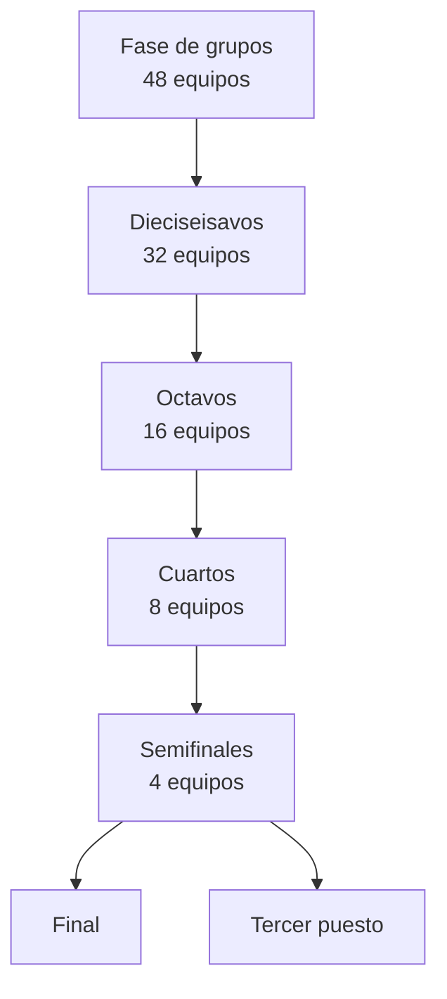

# 04 — Contexto del torneo: FIFA World Cup 2026

Este documento recoge el **contexto real del Mundial 2026** que la aplicación debe reflejar. Sirve de referencia para datos, UI (nombres de fases, sedes) y calendario.

---

## Datos generales

| Campo | Valor |
|-------|-------|
| **Edición** | 23.ª Copa Mundial de la FIFA |
| **Año** | 2026 |
| **Sedes** | Estados Unidos, Canadá, México |
| **Equipos** | **48** (expansión desde 32) |
| **Partidos totales** | **104** |
| **Inicio** | 11 de junio de 2026 |
| **Final** | 19 de julio de 2026 |
| **Duración** | ~39 días |

### Significado para la app

- La UI debe hablar de **48 selecciones**, no 32.
- El calendario tiene **más partidos** y una fase extra (dieciseisavos).
- Los **grupos van de la A a la L** (12 grupos de 4 equipos).

---

## Formato de competición

### Fase de grupos

```
12 grupos (A – L)
4 equipos por grupo
3 partidos por equipo en grupos
Top 2 de cada grupo → 24 clasificados
8 mejores terceros → 8 clasificados
─────────────────────────────────────
Total clasificados a eliminatoria: 32
```

**Criterios de clasificación** (para mostrar en UI informativa, no simular):

1. Puntos
2. Diferencia de goles
3. Goles a favor
4. Enfrentamiento directo (subcriterios FIFA)

La app **no calcula** clasificación automáticamente en v1; muestra resultados y tabla si se alimenta manualmente (futuro).

### Fase eliminatoria

| Ronda | Partidos | Equipos |
|-------|----------|---------|
| Dieciseisavos de final | 16 | 32 → 16 |
| Octavos de final | 8 | 16 → 8 |
| Cuartos de final | 4 | 8 → 4 |
| Semifinales | 2 | 4 → 2 |
| Tercer puesto | 1 | — |
| Final | 1 | 2 → 1 |



### Nomenclatura en español (UI)

| Código interno | Etiqueta UI |
|----------------|-------------|
| `group` | Fase de grupos |
| `round_of_32` | Dieciseisavos de final |
| `round_of_16` | Octavos de final |
| `quarter` | Cuartos de final |
| `semi` | Semifinales |
| `third_place` | Tercer puesto |
| `final` | Final |

---

## Calendario orientativo

> Las fechas exactas de cada partido se cargan en `matches.json`. Esta tabla es **referencia estructural**.

| Periodo | Fase |
|---------|------|
| 11–27 jun 2026 | Fase de grupos (3 jornadas) |
| 28 jun – 3 jul 2026 | Dieciseisavos |
| 4–7 jul 2026 | Octavos |
| 8–11 jul 2026 | Cuartos |
| 14–15 jul 2026 | Semifinales |
| 18 jul 2026 | Tercer puesto |
| 19 jul 2026 | Final |

La app DEBE mostrar horas en la **zona horaria del usuario** (configurable en ajustes), convirtiendo desde el `datetime` ISO de cada partido.

---

## Sedes y estadios

### Países anfitriones

| País | Rol |
|------|-----|
| México | 3 ciudades (incl. CDMX) |
| Estados Unidos | Mayor número de sedes |
| Canadá | Vancouver, Toronto, etc. |

### Estadios clave (seed `venues.json`)

| ID sugerido | Estadio | Ciudad | País |
|-------------|---------|--------|------|
| `estadio-azteca` | Estadio Azteca | Ciudad de México | México |
| `metlife-stadium` | MetLife Stadium | East Rutherford, NJ | EE.UU. |
| `sofi-stadium` | SoFi Stadium | Los Ángeles | EE.UU. |
| `att-stadium` | AT&T Stadium | Arlington, TX | EE.UU. |
| `mercedes-benz-atlanta` | Mercedes-Benz Stadium | Atlanta | EE.UU. |
| `hard-rock-miami` | Hard Rock Stadium | Miami | EE.UU. |
| `lumen-field` | Lumen Field | Seattle | EE.UU. |
| `levis-stadium` | Levi's Stadium | Santa Clara | EE.UU. |
| `bmo-field` | BMO Field | Toronto | Canadá |
| `bc-place` | BC Place | Vancouver | Canadá |

Lista completa oficial FIFA se incorpora progresivamente en `venues.json`.

---

## Grupos (estructura)

Los grupos A–L se asignan según el sorteo oficial. En `teams.json`, cada equipo lleva:

```json
{ "group": "J" }
```

### Visualización en app

- Vista **por grupo**: 4 equipos + mini-calendario de 6 partidos del grupo.
- Vista **por equipo**: badge de grupo visible en ficha.

**Nota:** Los emparejamientos exactos de eliminatorias dependen del sorteo y reglas FIFA; en v1 el bracket se muestra cuando `matches.json` incluye esas fases.

---

## Selecciones participantes (48)

La lista oficial se mantiene en `teams.json`. Regiones representadas:

| Confederación | Cupo aproximado |
|---------------|-----------------|
| UEFA | ~16 |
| CONMEBOL | ~6 |
| CONCACAF | ~6 (incl. anfitriones) |
| CAF | ~9 |
| AFC | ~8 |
| OFC | ~1 |
| Play-offs | Variable |

La app no necesita simular la clasificación; solo reflejar el listado final.

---

## Eventos especiales durante el torneo

| Evento | Impacto en la app |
|--------|-------------------|
| Convocatorias oficiales | Actualizar `players.json` por equipo |
| Lesiones / bajas | Marcar jugador o eliminar del pool de retos |
| Resultados en vivo | `status: live` + `score` |
| Partidos aplazados | `status: postponed` |
| Definición de mejores terceros | Actualizar bracket en `matches.json` |

---

## Modo sin spoilers

Durante eliminatorias, muchos usuarios retrasan ver partidos grabados.

| Configuración | Comportamiento |
|---------------|----------------|
| `spoilerMode: true` | Ocultar `score` en calendario, dashboard e inicio |
| `spoilerMode: false` | Mostrar resultados completos |

Los partidos `live` pueden mostrarse como "En juego" sin marcador si spoiler está activo.

---

## Retos contextuales (fase 2 de juegos)

Ideas para retos ligados al torneo en curso (documentados para extensión futura):

| Reto | Condición |
|------|-----------|
| "Goleadores del día" | Incluir jugador que marcó ayer |
| "Sorpresa del grupo" | Máximo X jugadores de equipos fuera del top 20 FIFA |
| "Rivalidad" | Jugadores de dos equipos que se enfrentan hoy |

Requieren actualización diaria de datos o flags en JSON.

---

## Referencias externas (para mantenimiento)

- FIFA.com — calendario y resultados oficiales
- Sorteo y reglas — documentación FIFA del formato 48 equipos

La app **no enlaza** a streams; solo puede citar sede y hora.

---

## Referencias internas

- Esquema de partidos → [03-data-model.md](./03-data-model.md)
- Calendario en UI → [05-features-data.md](./05-features-data.md)
- Actualización de resultados → [10-data-maintenance.md](./10-data-maintenance.md)
