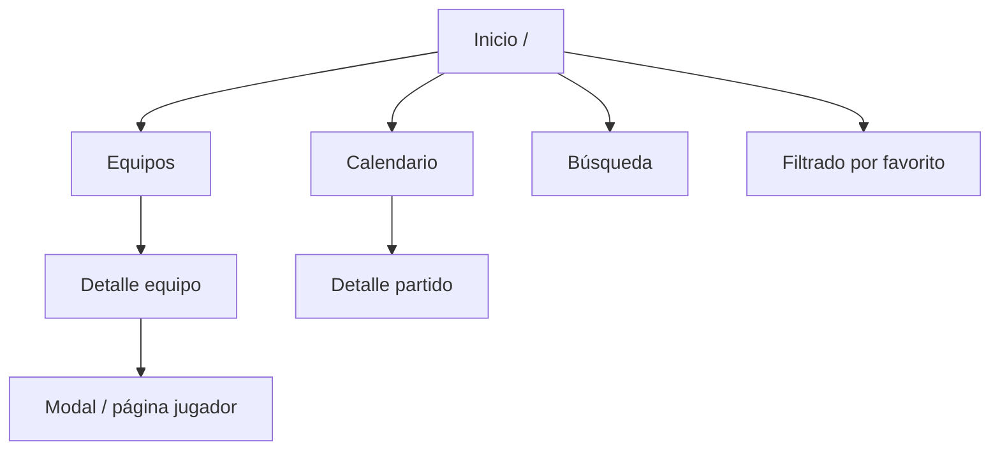

# 05 — Funcionalidades: Módulo de Datos

El módulo de **Datos** cubre todo lo relacionado con **consulta** de información del torneo. Debe ser útil desde el primer día aunque los juegos no estén listos.

---

## Objetivos del módulo

1. Encontrar cualquier equipo, jugador o partido en pocos toques.
2. Ver plantillas completas (o parciales según seed) con filtros.
3. Consultar calendario por fecha, fase o equipo favorito.
4. Respetar preferencias (favorito, zona horaria, spoilers).

---

## Mapa de pantallas



---

## 5.1 — Inicio (Dashboard)

**Ruta:** `/`

### Contenido

| Sección | Descripción | Prioridad |
|---------|-------------|-----------|
| **Hoy** | Partidos del día (hora local) | MUST |
| **Próximo favorito** | Siguiente partido del equipo favorito | SHOULD |
| **Accesos rápidos** | Enlaces a Equipos, Calendario, Juegos | MUST |
| **Resultados recientes** | Últimos 3 partidos finalizados | MAY (oculto si spoiler) |

### Comportamiento

- Si no hay favorito, mostrar CTA: "Elige tu selección" → configuración.
- Si no hay partidos hoy: mensaje + próxima jornada.
- Tarjetas de partido: escudos, hora, sede abreviada, estado.

### Criterios de aceptación

- [ ] Carga en < 2 s en 4G.
- [ ] Muestra al menos partidos del día desde `matches.json`.
- [ ] Respeta `spoilerMode` del localStorage.

---

## 5.2 — Equipos

**Ruta:** `/equipos`

### Vista lista

- **Grid** de 48 tarjetas (responsive: 2 col móvil, 4–6 desktop).
- Cada tarjeta: bandera, nombre, grupo, ranking FIFA.
- **Ordenación:** por grupo (default), alfabético, ranking.
- **Filtro:** por confederación, por grupo (chips A–L).

### Componente `TeamCard`

```
┌─────────────────────┐
│  [bandera]          │
│  Argentina          │
│  Grupo J · #1 FIFA  │
└─────────────────────┘
```

### Criterios de aceptación

- [ ] Las 48 selecciones visibles con datos de `teams.json`.
- [ ] Tap navega a `/equipos/[teamId]`.
- [ ] Filtro por grupo funciona sin recarga completa.

---

## 5.3 — Detalle de equipo

**Ruta:** `/equipos/[teamId]`

### Cabecera

- Bandera grande, nombre, grupo, confederación.
- Entrenador, ranking FIFA.
- Botón **"Marcar como favorito"** (estrella).

### Plantilla

- Lista de jugadores desde `players.json` filtrado por `teamId`.
- **Filtros:** posición (GK / DF / MF / FW).
- **Ordenación:** dorsal, rating, nombre.
- Jugadores `isKeyPlayer: true` con badge opcional.

### Layout jugador (fila)

| Campo visible | Notas |
|---------------|-------|
| Dorsal | Si existe |
| Nombre | — |
| Posición | Abreviatura + tooltip |
| Club | Texto secundario |
| Rating | Badge numérico |

### Estado vacío

Si el equipo no tiene jugadores en seed:

> "Plantilla en actualización. Vuelve pronto."

### Criterios de aceptación

- [ ] Muestra todos los jugadores del equipo en JSON.
- [ ] Favorito se persiste en `mundial2026_settings`.
- [ ] 404 amigable si `teamId` inválido.

---

## 5.4 — Calendario

**Ruta:** `/calendario`

### Vistas

| Vista | Descripción |
|-------|-------------|
| **Lista** (default) | Partidos cronológicos |
| **Por fase** | Tabs: Grupos, Dieciseisavos, Octavos, … |
| **Por grupo** | Solo fase de grupos, selector A–L |

### Filtros (Client)

- Fecha (date picker o chips: Hoy, Mañana, Esta semana).
- Equipo (autocomplete desde teams).
- Solo favorito (toggle).
- Estado: todos / programados / finalizados.

### Tarjeta de partido `MatchRow`

```
┌──────────────────────────────────────────────────┐
│ 11 jun · 19:00 (CDMX)          Fase de grupos   │
│ 🇦🇷 Argentina  vs  🇨🇦 Canadá                    │
│ Estadio Azteca · Programado                      │
└──────────────────────────────────────────────────┘
```

Con resultado (si no spoiler):

```
│ Argentina 2 – 0 Canadá · Finalizado              │
```

### Detalle de partido (modal o `/calendario/[matchId]`)

- Fecha/hora en zona usuario + hora sede.
- Sede con ciudad y país.
- Enlaces: ir a ficha de cada equipo.
- Árbitro: WON'T v1.

### Criterios de aceptación

- [ ] Todos los partidos de `matches.json` listados.
- [ ] Conversión de timezone correcta.
- [ ] Filtro por equipo muestra home y away.
- [ ] Spoiler oculta marcadores.

---

## 5.5 — Búsqueda global

**Ruta:** `/buscar` (también accesible desde header)

### Alcance

Busca en:

- Nombres de equipos (`name`, `shortName`)
- Nombres de jugadores
- Sedes (`venues.name`, `venues.city`)
- IDs de grupo ("Grupo J")

### UX

- Input con debounce 200 ms.
- Resultados agrupados: Equipos | Jugadores | Partidos | Sedes.
- Mínimo 2 caracteres para buscar.
- Highlight del término en resultados.

### Ejemplo de resultado

```
Jugadores
  Lionel Messi — Argentina · Delantero
Equipos
  Argentina — Grupo J
```

### Criterios de aceptación

- [ ] Búsqueda instantánea sobre dataset en memoria.
- [ ] Navegación al recurso correcto al pulsar.
- [ ] Sin resultados: mensaje + sugerencias (grupos populares).

---

## 5.6 — Configuración

**Ruta:** `/configuracion`

| Ajuste | Tipo | Default |
|--------|------|---------|
| Equipo favorito | select | `null` |
| Zona horaria | select (IANA) | Detectada del navegador |
| Modo sin spoilers | toggle | `true` |
| Tema | toggle dark/light | `dark` |

### Persistencia

Todo en `mundial2026_settings` (ver [03-data-model.md](./03-data-model.md)).

---

## 5.7 — Detalle de jugador (opcional v1)

**Ruta:** Modal desde plantilla o `/jugadores/[playerId]`

| Campo | Fuente |
|-------|--------|
| Nombre, dorsal, posición | `players.json` |
| Equipo | Link a team |
| Club, edad, rating | `players.json` |
| Acción | "Ver equipo completo" |

MAY en v1 — puede ser modal ligero en lugar de ruta dedicada.

---

## Interacciones entre datos y juegos

| Dato | Uso en juegos |
|------|---------------|
| `players.rating` | Coste/puntos en Reto del 11 |
| `players.position` | Validación de formación |
| `teams.group` | Retos por grupo |
| `teams.primaryColor` | Tanda 90 (camiseta visual) |

---

## Estados de carga y error

| Estado | Tratamiento |
|--------|-------------|
| JSON inválido en build | Falla CI (`validate-data`) |
| Equipo sin jugadores | Empty state en plantilla |
| Partido aplazado | Badge "Aplazado" ámbar |
| Sin conexión (PWA) | Datos cacheados; banner offline |

---

## Accesibilidad (datos)

- Contraste WCAG AA en texto y badges.
- Banderas con `alt` = nombre del país.
- Listas de jugadores navegables por teclado.
- Anuncio de resultados solo si spoiler desactivado.

---

## Referencias

- Esquemas → [03-data-model.md](./03-data-model.md)
- UI → [07-ui-ux.md](./07-ui-ux.md)
- Roadmap Fase 1 → [08-development-roadmap.md](./08-development-roadmap.md)
