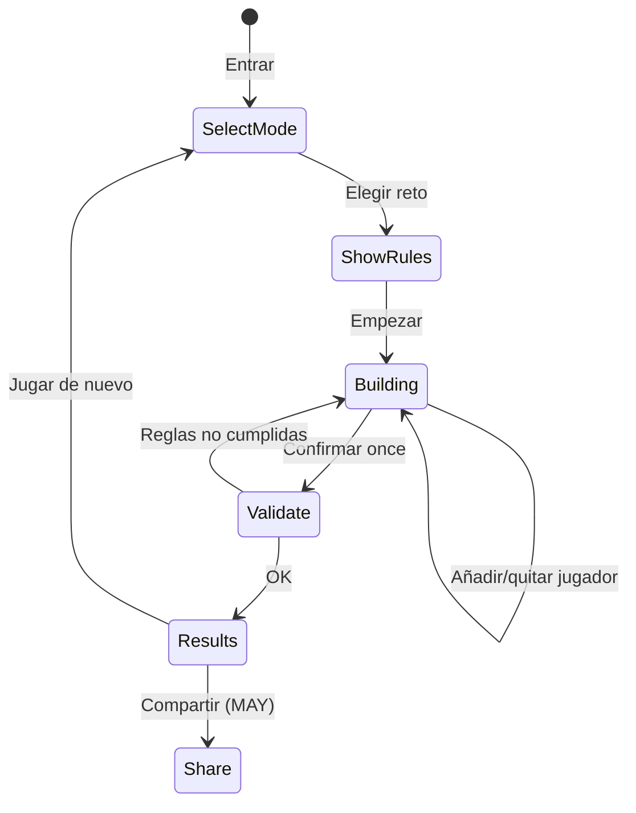
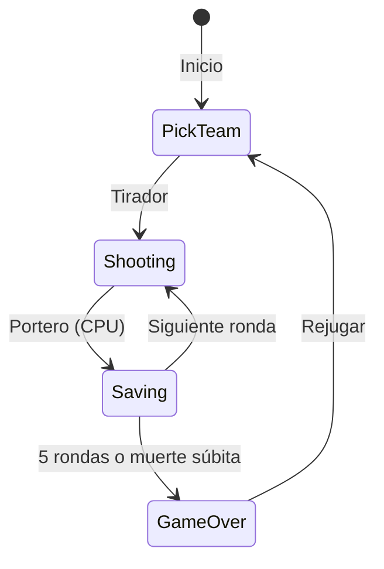

# 06 — Funcionalidades: Módulo de Juegos

Tres minijuegos conectados a los datos del torneo. Sesiones objetivo: **5–15 minutos**.

---

## Hub de juegos

**Ruta:** `/juegos`

```
┌─────────────────────────────────────────┐
│  🏆 Reto del 11          [Jugar]        │
│  Monta el mejor once con reglas         │
├─────────────────────────────────────────┤
│  ⚽ Tanda 90             [Jugar]        │
│  Tanda de penaltis arcade               │
├─────────────────────────────────────────┤
│  🧠 Trivia Express       [Jugar]        │
│  10 preguntas contra el reloj           │
└─────────────────────────────────────────┘
```

Cada tarjeta muestra récord personal si existe en localStorage.

---

## 6.1 — Reto del 11 ★ (juego principal)

**Ruta:** `/juegos/reto-del-11`

### Concepto

El usuario selecciona **11 jugadores** del pool global (todos los `players.json` disponibles) y los coloca en un campo visual. Debe cumplir las **reglas del reto** activo. Al confirmar, recibe una **puntuación** y feedback.

### Modos de juego

| Modo | Descripción | v1 |
|------|-------------|-----|
| **Libre** | Elige un reto de la lista | MUST |
| **Diario** | Un reto fijo por fecha (seed `YYYY-MM-DD`) | SHOULD |
| **Personalizado** | Reglas aleatorias | WON'T v1 |

### Flujo de pantallas



### Pantalla: Reglas

Muestra:

- Título y descripción del reto (`challenges.json`).
- Reglas en lenguaje humano (generadas desde `rules`).
- Formación visual (4-3-3 por defecto).

### Pantalla: Construcción

**Layout:**

```
┌─────────────────────────────────────────────────┐
│  Presupuesto: 73/100    Posiciones: ✓ ✓ ✓ ✗     │
├─────────────────────────────────────────────────┤
│              [ Campo con 11 slots ]               │
│         GK                                    │
│    DF    DF    DF    DF                       │
│         MF    MF    MF                         │
│              FW    FW    FW                     │
├─────────────────────────────────────────────────┤
│  [ Buscar jugador... ]                          │
│  Lista filtrable / draggable                    │
└─────────────────────────────────────────────────┘
```

### Interacciones

| Acción | Comportamiento |
|--------|----------------|
| Buscar jugador | Filtra por nombre, equipo, posición |
| Añadir | Tap o drag a slot compatible |
| Quitar | Tap en jugador del campo |
| Auto-fill sugerido | WON'T v1 |
| Confirmar | Valida reglas → calcula score |

### Validación de reglas

Implementada en `lib/games/reto11/validate.ts`.

| Regla | Validación |
|-------|------------|
| `maxPlayers: 11` | Exactamente 11 |
| `budget` | `sum(rating) <= budget` |
| `maxPerTeam` | Ningún `teamId` repetido más de N veces |
| `requiredPositions` | Mínimos por GK/DF/MF/FW |
| `allowedGroups` | `team.group` del jugador en lista |
| `allowedTeams` | `teamId` en lista |

**Errores:** Lista clara bajo el campo ("Necesitas 1 portero más", "Superas el presupuesto en 12 puntos").

### Sistema de puntuación

Implementado en `lib/games/reto11/score.ts`.

**Base:** Suma de `rating` de los 11 jugadores.

**Bonuses (configurables por reto):**

| Bonus | Condición | Puntos |
|-------|-----------|--------|
| `same_team_pairs` | ≥2 pares del mismo club o selección | +2 por par |
| `all_confederations` | ≥1 jugador de cada confederación representada | +5 |
| `perfect_formation` | Exactamente los mínimos de posición | +3 |

**Fórmula display:**

```
Puntuación final = base + Σ bonuses
```

### Desafío diario

- Seed: `hash(fecha + challengeId)` o rotación fija por día del año.
- Un solo intento "oficial" por día (guardado en `dailyCompleted`).
- Reintentos permitidos pero no sobrescriben el oficial (o se guardan como práctica — decisión: **solo primer intento cuenta para récord diario**).

### Pantalla: Resultados

- Puntuación grande animada.
- Desglose base + bonuses.
- Comparación con récord personal del reto.
- Lista del once con ratings.
- Botones: Reintentar, Otro reto, Compartir.

### Retos seed (MVP)

| ID | Título | Reglas clave |
|----|--------|--------------|
| `budget-100` | Presupuesto 100 | budget 100, max 3 por equipo |
| `world-xi` | Once mundial | max 1 por equipo |
| `group-heroes` | Héroes del Grupo A | allowedGroups: ["A"] |
| `south-america` | Sudamericanos | allowedTeams: filtro CONMEBOL |
| `balanced` | Equilibrado | requiredPositions estándar |

Definidos en `data/challenges.json`.

### Criterios de aceptación

- [ ] Se puede completar un once de 11 con búsqueda funcional.
- [ ] Validación bloquea confirmación si reglas fallan.
- [ ] Puntuación reproducible (misma entrada → mismo score).
- [ ] Récord guardado en localStorage.
- [ ] Desafío diario cambia a medianoche timezone usuario.

---

## 6.2 — Tanda 90

**Ruta:** `/juegos/tanda-90`

### Concepto

Simulador arcade de **tanda de penaltis** al mejor de 5 rondas (muerte súbita si empate tras 5).

### Flujo



### Selección de equipo

- Elegir selección de `teams.json` (afecta colores visuales).
- Rival: CPU con nombre genérico ("Selección Rival") o random team.

### Mecánica de tirador

1. Elige esquina: **Izquierda | Centro | Derecha** (botones o swipe).
2. Barra de potencia oscilante; pulsar para fijar.
3. Precisión = combinación de esquina + timing de potencia.

### Mecánica de portero (usuario)

Cuando CPU tira:

1. Misma elección de esquina.
2. Ventana de reacción ~1.5 s.

### IA CPU (portero y tirador)

| Nivel | Comportamiento |
|-------|----------------|
| Tirador CPU | 70% apunta a esquina elegida aleatoria ponderada |
| Portero CPU | 40% adivina esquina del usuario; resto random |

Sin dificultad seleccionable en v1.

### Representación visual

- Canvas 2D o DOM con CSS (decisión implementación: DOM + CSS para v1).
- Portería vista frontal simplificada.
- Marcador: rondas ganadas usuario vs CPU.
- Animación breve (~800 ms) por penal.

### Persistencia

```json
{
  "wins": 10,
  "losses": 7,
  "bestStreak": 4
}
```

En `mundial2026_tanda90`.

### Criterios de aceptación

- [ ] Partida completa 5 penaltis sin bugs.
- [ ] Muerte súbita funciona en empate.
- [ ] Controles usables en móvil (touch).
- [ ] Stats básicas persistidas.

---

## 6.3 — Trivia Express

**Ruta:** `/juegos/trivia`

### Concepto

**10 preguntas**, **60 segundos** total (o 15 s por pregunta — decisión: **60 s global** para más tensión).

### Generación de preguntas

`lib/games/trivia/generate.ts` construye preguntas desde datos:

| Tipo | Ejemplo | Datos |
|------|---------|-------|
| `player_country` | ¿De qué país es X? | players + teams |
| `team_group` | ¿En qué grupo está Y? | teams |
| `player_position` | ¿Qué posición juega Z? | players |
| `venue_city` | ¿En qué ciudad está el Azteca? | venues |
| `match_teams` | ¿Quién vs quién el 11 jun? | matches |

### Formato de pregunta

```typescript
interface TriviaQuestion {
  id: string;
  type: string;
  text: string;
  options: string[];      // 4 opciones
  correctIndex: number;
}
```

Siempre **4 opciones**, 1 correcta. Distractores del mismo tipo (otros países, otros grupos).

### Puntuación

| Evento | Puntos |
|--------|--------|
| Respuesta correcta | +100 |
| Bonus tiempo restante | +2 × segundos restantes al responder |
| Respuesta incorrecta | 0 |
| Sin responder | 0 |

### Pantallas

1. **Intro** — Reglas, récord personal.
2. **Quiz** — Pregunta, opciones, timer global.
3. **Resultados** — Score, aciertos X/10, desglose.

### Anti-repetición

- En una sesión, no repetir jugador/equipo.
- Entre sesiones, shuffle con seed aleatorio.

### Criterios de aceptación

- [ ] 10 preguntas generadas sin errores de datos.
- [ ] Timer visible y funcional.
- [ ] Récord guardado en localStorage.
- [ ] Funciona con seed parcial de jugadores (fallback a preguntas de equipos/venues).

---

## Progreso y récords unificados

### Pantalla opcional: Mis récords

**Ruta:** `/juegos/records` (MAY v1)

| Juego | Métrica |
|-------|---------|
| Reto del 11 | Mejor score por reto, diarios completados |
| Tanda 90 | Victorias, racha |
| Trivia | Mejor puntuación, media aciertos |

---

## Compartir resultados (MAY v1)

### Reto del 11

Texto generado:

```
🏆 Reto del 11 — Presupuesto 100
Puntuación: 842
Once: Messi, Mbappé, ...
mundial2026hub.app (cuando exista URL)
```

Opcional: generar imagen con canvas (fase posterior).

---

## Dependencias de datos mínimas por juego

| Juego | Mínimo requerido |
|-------|------------------|
| Reto del 11 | ≥11 jugadores en pool global, ≥1 challenge |
| Tanda 90 | ≥1 team (solo visual) |
| Trivia | ≥4 teams, ≥4 players, ≥1 venue, ≥1 match |

---

## Referencias

- Esquema challenges → [03-data-model.md](./03-data-model.md)
- Arquitectura `lib/games/` → [02-architecture.md](./02-architecture.md)
- Roadmap Fases 2–4 → [08-development-roadmap.md](./08-development-roadmap.md)
