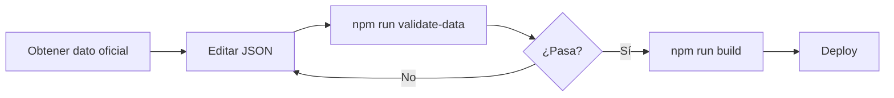

# 10 — Guía de mantenimiento de datos

Operativa para **actualizar, ampliar y corregir** los datos del torneo durante y después del Mundial 2026.

---

## Principios de mantenimiento

1. **Nunca editar en producción sin validar** — Siempre ejecutar `npm run validate-data` antes de deploy.
2. **Un cambio, un commit** — Facilita rollback si un resultado o jugador es incorrecto.
3. **Incrementar `dataVersion`** solo en cambios breaking de esquema.
4. **Actualizar `lastUpdated`** en `tournament.json` en cada sesión de mantenimiento.

---

## Archivos y cuándo tocarlos

| Archivo | Cuándo actualizar |
|---------|-------------------|
| `tournament.json` | Cambio de fase, fechas meta |
| `teams.json` | Corrección de grupo, entrenador, ranking |
| `players.json` | Convocatorias, bajas, dorsales |
| `matches.json` | Calendario, resultados, estados |
| `venues.json` | Nuevos estadios o correcciones |
| `challenges.json` | Nuevos retos (poco frecuente) |

---

## Flujo de trabajo recomendado



---

## Actualizar resultados de partidos

### Durante el partido

```json
{
  "id": "match-group-j-001",
  "status": "live",
  "score": { "home": 1, "away": 0 }
}
```

### Al finalizar

```json
{
  "status": "finished",
  "score": { "home": 2, "away": 1 }
}
```

### Con penales (eliminatorias)

El marcador del 90' va en `score`. Los penales en `penaltyScore`:

```json
{
  "score": { "home": 1, "away": 1 },
  "penaltyScore": { "home": 4, "away": 3 },
  "status": "finished"
}
```

### Partido aplazado

```json
{
  "status": "postponed",
  "datetime": "2026-06-12T20:00:00-06:00"
}
```

---

## Añadir jugadores a una plantilla

1. Verificar que `teamId` existe en `teams.json`.
2. Generar `id` slug único: `nombre-apellido` en minúsculas, sin acentos.
3. Asignar `position` y `rating` según guía abajo.
4. Ejecutar validación.

```json
{
  "id": "julian-alvarez",
  "name": "Julián Álvarez",
  "teamId": "argentina",
  "position": "FW",
  "number": 9,
  "club": "Atlético de Madrid",
  "age": 26,
  "rating": 84,
  "isKeyPlayer": true
}
```

### Guía rápida de ratings

| Perfil | Rango |
|--------|-------|
| Balón de oro / top 10 mundial | 90–99 |
| Titular elite | 85–89 |
| Titular sólido | 78–84 |
| Rotación / joven promesa | 72–77 |
| Suplente | 65–71 |
| Relleno convocatoria | 55–64 |

Los ratings son **subjetivos simplificados** para el juego, no datos oficiales FIFA.

---

## Eliminar o marcar baja de jugador

**Opción A (preferida):** Eliminar del JSON si no está convocado.

**Opción B (histórico):** Campo futuro `active: false` — no implementado en v1; usar eliminación.

Tras baja de último minuto, actualizar antes del partido si afecta retos del día.

---

## Ampliar calendario

### Nuevo partido de grupos

```json
{
  "id": "match-group-a-002",
  "phase": "group",
  "group": "A",
  "matchday": 1,
  "homeTeamId": "mexico",
  "awayTeamId": "south-africa",
  "datetime": "2026-06-11T14:00:00-06:00",
  "venueId": "estadio-azteca",
  "status": "scheduled",
  "score": null
}
```

### Convención de IDs de partido

```
match-{phase}-{group?}-{sequential}

Ejemplos:
  match-group-j-001
  match-r32-001
  match-final-001
```

---

## Cambiar fase del torneo

En `tournament.json`:

```json
{
  "currentPhase": "round_of_16",
  "lastUpdated": "2026-07-05"
}
```

La UI puede usar este campo para destacar la fase activa en el dashboard.

---

## Añadir un reto nuevo

En `challenges.json`:

```json
{
  "id": "european-power",
  "type": "standard",
  "title": "Potencia europea",
  "description": "Solo jugadores de selecciones UEFA.",
  "rules": {
    "maxPlayers": 11,
    "maxPerTeam": 2,
    "allowedTeams": ["spain", "france", "germany"],
    "requiredPositions": { "GK": 1, "DF": 3, "MF": 3, "FW": 2 }
  },
  "scoring": {
    "base": "sum_rating",
    "bonuses": []
  }
}
```

Para filtrar por confederación sin listar todos los equipos, usar script de generación o lista explícita en `allowedTeams`.

---

## Validación local

```bash
# Desde la raíz del proyecto
npm run validate-data
```

### Errores comunes

| Error | Causa | Solución |
|-------|-------|----------|
| `teamId not found` | Jugador referencia equipo inexistente | Añadir team o corregir typo |
| `duplicate id` | Dos jugadores mismo id | Renombrar slug |
| `invalid datetime` | Formato sin timezone | Usar ISO 8601 con offset |
| `rating out of range` | Rating 0 o 100 | Mantener 1–99 |
| `group mismatch` | 5 equipos en grupo A | Revisar asignación |

---

## Fuentes de información recomendadas

| Dato | Fuente sugerida |
|------|-----------------|
| Resultados y horarios | FIFA.com oficial |
| Convocatorias | Comunicados federaciones / FIFA |
| Dorsales | Publicaciones pre-partido FIFA |
| Entrenadores | FIFA team pages |

**No scrapear** sitios con ToS restrictivo en pipeline automático v1. Actualización manual o CSV intermedio.

---

## Plantilla CSV (opcional, futuro)

Para importación masiva de jugadores:

```csv
id,name,teamId,position,number,club,age,rating,isKeyPlayer
lionel-messi,Lionel Messi,argentina,FW,10,Inter Miami,39,88,true
```

Script futuro: `scripts/import-players.ts` → genera `players.json`.

---

## Checklist post-jornada

- [ ] Actualizar `status` y `score` de partidos jugados
- [ ] Verificar partidos `live` no quedaron colgados
- [ ] Actualizar `tournament.currentPhase` si cambió
- [ ] Revisar bajas/convocatorias para jugadores clave
- [ ] `npm run validate-data`
- [ ] Deploy
- [ ] (Opcional) Añadir reto contextual del día

---

## Checklist pre-jornada

- [ ] Confirmar horarios `datetime` (cambios de TV)
- [ ] Estados en `scheduled`
- [ ] Spoiler: usuarios con modo activo no verán resultados previos

---

## Rollback

Si un deploy introduce datos erróneos:

```bash
git revert HEAD
# o restaurar archivo específico
git checkout HEAD~1 -- data/matches.json
npm run validate-data && npm run build
```

---

## Contacto con el código

| Operación | Archivo código relacionado |
|-----------|----------------------------|
| Cargar partidos | `src/lib/data/matches.ts` |
| Filtrar por fecha | `src/lib/data/filters.ts` |
| Pool de jugadores juego | `src/lib/games/reto11/pool.ts` |
| Preguntas trivia | `src/lib/games/trivia/generate.ts` |

Cambios en JSON **no requieren** cambio de código salvo nuevos campos (actualizar Zod).

---

## Referencias

- Esquemas completos → [03-data-model.md](./03-data-model.md)
- Contexto torneo → [04-tournament-context.md](./04-tournament-context.md)
- Roadmap datos → [08-development-roadmap.md](./08-development-roadmap.md) Fase 5
